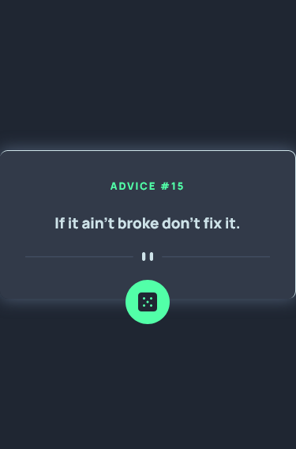

# Frontend Mentor - Advice generator app solution

This is a solution to the [Advice generator app challenge on Frontend Mentor](https://www.frontendmentor.io/challenges/advice-generator-app-QdUG-13db). Frontend Mentor challenges help you improve your coding skills by building realistic projects.

## Table of contents

- [Overview](#overview)
  - [The challenge](#the-challenge)
  - [Screenshot](#screenshot)
  - [Links](#links)
  - [Built with](#built-with)
  - [Author](#author)

## Overview

### The challenge

The challenge is to build out this advice generator app using the [Advice Slip API](https://api.adviceslip.com) and get it looking as close to the design as possible.

Your users should be able to:

- View the optimal layout for the app depending on their device's screen size
- See hover states for all interactive elements on the page
- Generate a new piece of advice by clicking the dice icon

### Screenshot

### Links

- Solution URL: [Click here](https://www.frontendmentor.io/solutions/api-html-sass-javascript-advice-generator-app-Kv9KnCaA0)
- Live Site URL: [Click here](https://hatwell-jonel.github.io/frontendmentor-advicegenerator/)

### Built with

- Semantic HTML5 markup
- SASS
- Mobile-first workflow
- JavaScript
- API

### Author

- Portfolio - [My Personal Portfolio](https://hatwell-jonel.github.io/PORTFOLIO/)
- Frontend Mentor - [@hatwell-jonel](https://www.frontendmentor.io/profile/hatwell-jonel)
- LinkedIn - [Jonel Hatwell](https://www.linkedin.com/in/jonel-hatwell/)
